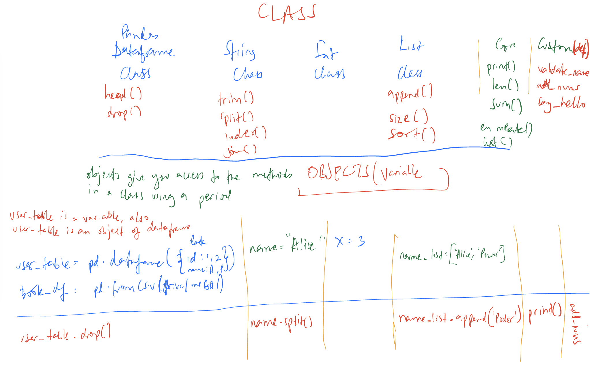

# Python Data Analytics Cheat Sheet

This a cheatsheet to include most commonly used functions in Data Analysis with 
Python and other major libraries like Pandas, Sci-kitlearn, Seaborn, etc

For beginnerts, the diagram below shows a basic ogranization of functions and 
their usage in Python.

The diagram has the most commonly used classes such as `String`, `List`. It has also 
common core funcyion such as `enumarate`. 

This readme will split into sections. Each section will have commonly used fucctions
belonging to the Class or Library, and a few examples. Futher documentation is linked
to w3schools for Python and Pandas libs for Pandas.




### Core

#### enumerate()
[Official Docs](https://www.w3schools.com/python/ref_func_enumerate.asp)

The enumerate function is among then inbuilt functions that adds a counter to 
an iterable and returns an iterator(turple) in the format `index, element`

_Example 1_

```fruits = ["apple", "banana", "cherry"]
for index, fruit in enumerate(fruits):
    print(index, fruit)
```
_output:_

```
0 apple
1 banana
2 cherry
```

_Example 2_

Incase you want the counter to start with a different value
```fruits = ["apple", "banana", "cherry"]
for index, fruit in enumerator(fruits, start=1):
    print(index, fruit)
```
_output_

```
1 apple
2 banana
3 cherry
```

### String

##### join()

[Official Docs](https://www.w3schools.com/python/ref_string_join.asp)
The join function is a string method that returns a string in which the elements 
of a sequence have been joined by a specified delimiter. Its also called a 
delimiter string.

_Example 1_
```
words = ["Hello", "world"]
result = ' '.join(words)
print(result)
```
_output:_

`Hello world`

_Example 2_
```
words = ["apple", "banana", "cherry"]
result = ', '.join(words)
print(result)
```
_output:_

`apple, banana, cherry`

_Example 3_

```
lines = ["Line 1", "Line 2", "Line 3"]
result = '\n'.join(lines)
print(result)
```
_output:_

```
Line 1
Line 2
Line 3
```


### List

##### append()
[Official Docs](https://www.w3schools.com/python/ref_list_append.asp)

The append function adds a variable to a list. 

_Example 1_
```
my_list = [1, 2, 3]
my_list.append(4)
print (my_list)
```
_output:_

`[1, 2, 3, 4]`

_Example 2_

```
my_list = ["a", "b", "c"]
my_list.append("d")
print (my_list)
```
_output:_

`["a", "b", "c", "d"]`


### Pandas class
#### read_csv()
[Official Docs] (https://www.w3schools.com/python/pandas/pandas_csv.asp)

This is one of the most used functions in pandas for reading data into a dataframe. The csv stands for comma-separated values.
The csv files are the most common import and export format for spreadsheets and databases.

Used as;

`import pandas as pd`

df = `pd.read_csv('customer_data.csv')`

`pd.read_csv` is the function.

`customer_data.csv` is the file you are importing. 


### Pandas dataframe
#### describe()
[Official Docs](https://www.w3schools.com/python/pandas/ref_df_describe.asp#:~:text=The%20describe()%20method%20returns,The%20average%20(mean)%20value.)


The `describe()` is a method/function that provides descriptive statistics that summarize the central tendency, dispersion, and shape of a dataset’s distribution, excluding NaN values. It is used mostly in Machine Learning, basically returns the description of the dataframe.

_Example 1_

```
data = {
'TransactionID': [1, 2, 3, 4, 5],
'StoreLocation': ['New York', 'Los Angeles', 'New York', 'Chicago', 'Los Angeles'],
'Date': ['2021-01-01', '2021-01-02', '2021-01-02', '2021-01-02', '2021-01-03'],
'ItemCategory': ['Electronics', 'Apparel', 'Toys', 'Electronics', 'Apparel'],
'UnitPrice': [299.99, 49.99, 15.99, 199.99, 39.99],
'UnitsSold': [3, 5, 10, 1, 2]
}
df = pd.DataFrame(data)
print(df[['UnitPrice', 'UnitsSold']].describe())
```

_output_

`UnitPrice   UnitsSold

count 5.000000 5.000000
mean 121.190000 4.200000
std 123.398541 3.563706
min 15.990000 1.000000
25% 39.990000 2.000000
50% 49.990000 3.000000
75% 199.990000 5.000000
max 299.990000 10.000000`

The `mean` is the average value of the dataset. It is calculated by summing up all the values in a data set and then dividing by the number of values. In the context of the example provided earlier where we calculated the summary statistics for 'UnitPrice' and 'UnitsSold' using `describe()`, the mean tells us the average unit price and average number of units sold across all transactions in our sample dataset.
It is used for example in comparative analysis, benchmarking among others, for example, if a particular transaction has a much higher unit price than the mean, it could be considered an outlier.

### Merge()

[Official Docs] (https://www.w3schools.com/python/pandas/ref_df_merge.asp)

The merge() method allows you to merge DataFrame objects by aligning them on columns.
The merge() function with `how='inner'` performs an inner join operation, which is the default mode for the merge() function in pandas. An inner join results in a DataFrame that contains only the rows that have matching values in both the left and right DataFrames as seen in example 1.
The merge() function with `how='left'` performs a left join operation between two DataFrames. A left join means that the resulting DataFrame will have all the rows from the left DataFrame as seen in example 2.
The merge() function with `how='outer'` join produces a DataFrame that includes all rows from both the left and right DataFrames, matching up rows where possible. Where there is no match for a particular key in one DataFrame, the result will have NaN in the columns as seen in Example3.
The merge() function with `how='right'` performs a right join on two DataFrames. This is almost like the left join only that this one prioritizes the right column first as seen in Example4.

_Example1_

```
import pandas as pd

# DataFrame of customers
customers = pd.DataFrame({
    'customer_id': [1, 2, 3],
    'customer_name': ['Alice', 'Bob', 'Charlie']
})

# DataFrame of orders
orders = pd.DataFrame({
    'customer_id': [1, 2, 4],
    'order_id': [100, 101, 102]
})

# Merge DataFrames on customer_id
customers_orders = pd.merge(customers, orders, on='customer_id', how='inner')

customers_orders.head()
```
_Output_
```customer_id customer_name  order_id
0            1         Alice       100
1            2           Bob       101
```
_Example2_

```import pandas as pd

# DataFrame of customers
customers = pd.DataFrame({
    'customer_id': [1, 2, 3],
    'customer_name': ['Alice', 'Bob', 'Charlie']
})

# DataFrame of orders
orders = pd.DataFrame({
    'customer_id': [1, 2, 4],
    'order_id': [100, 101, 102]
})

# Merge DataFrames on customer_id
merged_df = pd.merge(customers, orders, on='customer_id', how='left')

print(merged_df)
```
_Output_

```customer_id customer_name  order_id
0            1         Alice     100.0
1            2           Bob     101.0
2            3       Charlie       NaN
```

_Example3_
```import pandas as pd

# DataFrame of customers
customers = pd.DataFrame({
    'customer_id': [1, 2, 3],
    'customer_name': ['Alice', 'Bob', 'Charlie']
})

# DataFrame of orders
orders = pd.DataFrame({
    'customer_id': [1, 2, 4],
    'order_id': [100, 101, 102]
})

# Merge DataFrames on customer_id
customers_orders = pd.merge(customers, orders, on='customer_id', how='outer')

customers_orders.head()
```
_Output_
```	customer_id	customer_name	order_id
0	1	Alice	100.0
1	2	Bob	101.0
2	3	Charlie	NaN
3	4	NaN	102.0
```
_Example4_

```import pandas as pd

# DataFrame of customers
customers = pd.DataFrame({
    'customer_id': [1, 2, 3],
    'customer_name': ['Alice', 'Bob', 'Charlie']
})

# DataFrame of orders
orders = pd.DataFrame({
    'customer_id': [1, 2, 4],
    'order_id': [100, 101, 102]
})

# Merge DataFrames on customer_id
customers_orders = pd.merge(customers, orders, on='customer_id', how='right')

customers_orders.head()
```
_Output_
```customer_id	customer_name	order_id
0	1	Alice	100
1	2	Bob	101
2	4	NaN	102
```